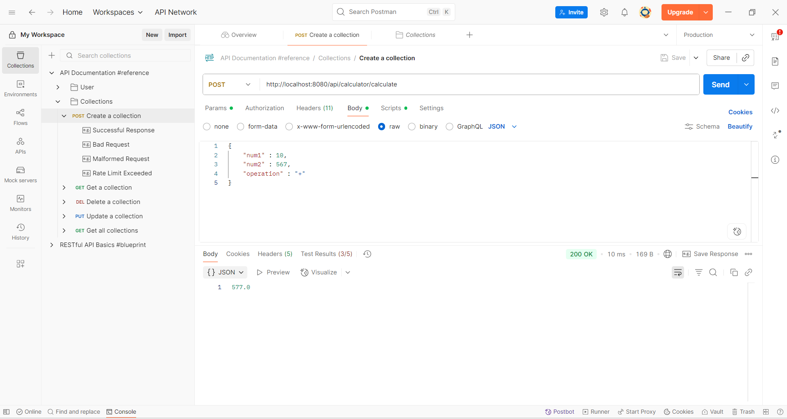
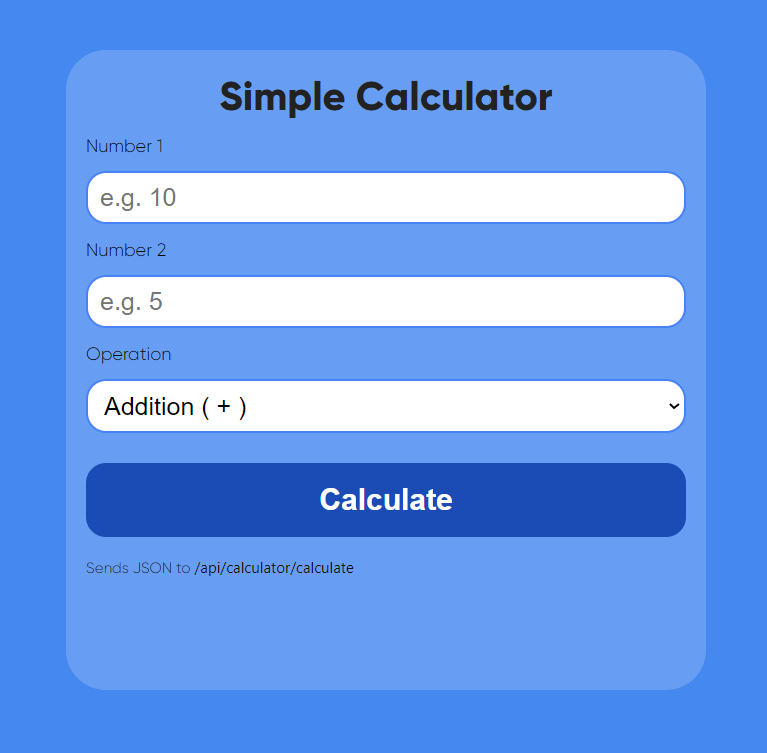

# 🧮 Spring Boot Calculator API

[](https://www.oracle.com/java/)
[](https://spring.io/projects/spring-boot)
[](LICENSE)

A simple RESTful **Calculator application** built with Java and Spring Boot.  
It provides an API (and optional HTML UI) to perform basic arithmetic operations.

---

## ✨ Features

- ➕ Addition, ➖ Subtraction, ✖ Multiplication, ➗ Division, % Modulo
- Layered architecture (**Controller → Service → Model**)
- Validation for invalid operations & divide-by-zero
- Ready-to-use with **Postman**
- Optional simple **HTML frontend** for direct usage

---

## 📸 Screenshots

| API Testing in Postman | HTML UI |
|------------------------|---------|
|  |  |

---

## 🛠️ Tech Stack

- Java 23
- Spring Boot 3.x
- Maven
- Postman (for testing)

---

## 📂 Project Structure
```
src/
└── main/
├── java/com/example/calculator
│ ├── CalculatorApplication.java # Main Spring Boot class
│ ├── controller/CalculatorController # REST Controller
│ ├── service/CalculatorService # Business logic
│ └── model/CalculatorRequest # Request model
└── resources/
|  ├── static/
|     ├── index.html
|     ├── style.css
|     └── script.js
|  ├── /templates
└── application.properties
```
---

## ⚙️ How to Run Locally

1. Clone the repository:
   ```git clone https://github.com/your-username/calculator-app.git```
   ```cd calculator-app```

2. Build and run the Spring Boot app:

mvn spring-boot:run
or run CalculatorApplication.java from your IDE.

3. The API will be available at:

http://localhost:8080/api/calculator/calculate

📬 Example Request (POST)
URL: http://localhost:8080/api/calculator/calculate
Headers: Content-Type: application/json

Body:
```
json
{
  "num1": 10,
  "num2": 5,
  "operation": "*"
}

```
Response:

50.0


🌐 Optional HTML Frontend
After running the app, open:

http://localhost:8080/index.html
to use the simple browser-based calculator UI.

📝 License
This project is open source and available under the MIT License.
